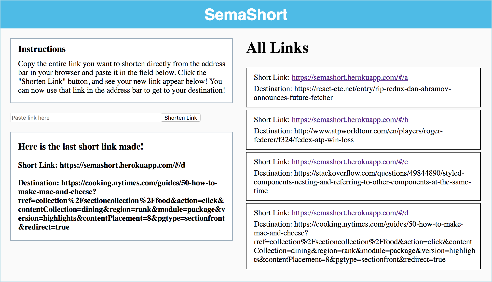

# SemaShort

SemaShort is a URL shortener that allows you to take URLs that are too long and cumbersome for convenient sharing and shorten them, making a short link that is easy to include in text messages and emails.

[SemaShort](http://semashort.herokuapp.com/#/)

### Instructions
Copy the entire link you want to shorten directly from the address bar in your browser and paste it in the field below. Click the "Shorten Link" button, and see your new link appear below! You can now use that link in the address bar to get to your destination!

### Technologies
This application uses React, Redux, JavaScript and Ruby on Rails. Redux and JavaScript are used in connection with Rails to access the database of links and determine what the next short link should be. The React form then generates the new short link, passes it back to the database, and renders it for the user to see and copy.

The redirection effect works by creating a React component that, upon mounting, takes the shortened URL that was entered in address bar, finds the corresponding destination URL, and then changes the window location to the destination URL.
